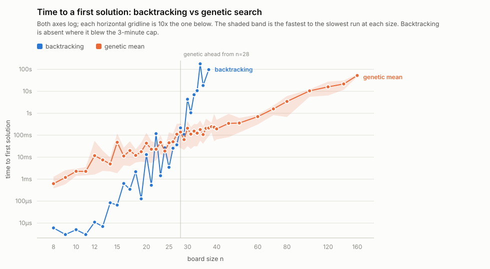
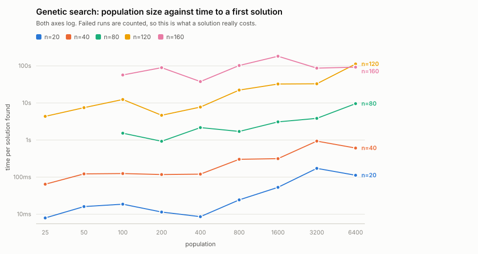

# nqueens

Place *n* non-attacking queens on an *n*x*n* board, by exhaustive backtracking
or by genetic search, and measure which is faster where.

## Build

```sh
cmake -S . -B build
cmake --build build
ctest --test-dir build
```

Requires CMake 3.20+ and a C17 compiler. Useful switches:

| Option | Default | Effect |
| --- | --- | --- |
| `-DNQUEENS_BUILD_TESTS=OFF` | `ON` | skip the test suite |
| `-DNQUEENS_WERROR=ON` | `OFF` | warnings become errors |
| `-DNQUEENS_SANITIZE=ON` | `OFF` | address + undefined-behaviour sanitizers |

## Use

```
usage: nqueens [options]

  -n, --size N            board size (default 8, max 1000)
  -a, --algorithm NAME    backtrack (exhaustive) or genetic (default backtrack)
  -m, --max-solutions N   stop after N solutions (default: all)
  -t, --time-limit SECS   wall-clock budget (default: none)
  -c, --count-only        report totals, do not print boards
  -H, --heatmap           print how often each square was used
  -h, --help              this message

genetic only:
  -p, --population N      individuals per generation (default 10n, min 400)
      --mutation-rate F   per-child mutation probability (default 0.9)
      --seed N|clock      RNG seed (default: from the clock, so runs differ);
                          pass the seed printed in the summary to repeat a run
      --generations N     stop after N generations (default: no limit)
      --stall N           give up after N generations without a fitness gain,
                          0 to never (default 2000)
      --progress N        progress line every N generations, 0 to silence
```

While a search runs:

| Key | Effect |
| --- | --- |
| any key | show where it has got to — the last solution found, or for the genetic search the best board in the population |
| `q` or ESC | stop |
| Ctrl-C | stop |

However it ends, you still get the summary. This is the original's `kbhit()`
peek, which was the only way to watch a run on a machine that took minutes to
reach n=12. It needs a terminal: when stdin is a pipe or a test harness,
polling is switched off and nothing is read from stdin.

Genetic runs print the seed they used, because the default seed comes from the
clock. Pass it back with `--seed` to replay a run exactly.

```sh
nqueens -n 8                      # all 92 solutions, printed
nqueens -n 12 -c                  # count them: 14200
nqueens -n 8 -c -H                # square occupancy across all 92
nqueens -a genetic -n 20 -m 1     # one 20-queens solution by evolution
```

Exit status is 0 when the search ran to its own conclusion, 1 when it was cut
short by `--time-limit`, `q`/ESC or Ctrl-C. A board with no solutions (`-n 3`)
is a complete search, so it exits 0.

## How it works

**Backtracking** walks rows top to bottom, trying columns left to right, and
keeps occupancy flags for each column and each of the two diagonal families —
so rejecting a square is one array lookup rather than a scan of the board. It
enumerates in the same order the original did, and `tests/data/queens8.txt` is
the original program's own 8-queens output, held as a regression fixture.

**Genetic search** encodes a placement as one column index per row. Fitness
scores each row by how few queens attack it, doubling rows that are clean; a
solution scores `2n³`. Each generation the ranked bottom half is replaced by
one-point-crossover children of randomly chosen top-half parents, each child
mutating one row with probability `--mutation-rate`. It is not exhaustive: it
stops when it stalls (no fitness gain for `--stall` generations), when it runs
out of budget, or when it has found as many solutions as you asked for. At the defaults it finds a
solution for boards up to about n=40 in well under a second.

## Benchmarks

`tools/bench.py` times how long each solver takes to reach its *first* solution.
It needs only python3; the charts are SVG, written directly.

```sh
tools/bench.py crossover     # time to first solution vs board size
tools/bench.py population    # time to first solution vs population
tools/bench.py chart         # render bench/*.svg and bench/report.html
```

Each run is capped by `--limit`, 180s by default, and each sweep by `--budget`.
Rows are flushed to CSV as they are measured, so an interrupted sweep still
leaves usable data and `--resume` continues it.

Backtracking is deterministic, so each size is the median of repeated runs. The
genetic search is not, and it dead-ends, so each size is several runs from fixed
seeds. The chart plots the mean over the runs that succeeded, banded with the
fastest and the slowest of them; the table beside it adds the total time spent
per solution actually obtained, which counts the failures too.

Results, and the machine and binary that produced them, are in `bench/`.

### Board size



Backtracking is about a hundred times faster at n=8 and holds the lead to n=27,
dropping only n=22 and n=24 on the way. Its cost does not grow smoothly. Whether
the first solution sits early or late in the depth-first order has nothing to do
with board size, so n=30 takes 4s while n=31 takes 1s, and n=34 takes 178s while
n=35 takes 18s.

Genetic search leads from n=28, that being the smallest size past which it wins
at every size measured. Between n=22 and n=27 the two swap places repeatedly, so
a single crossing point would be misleading.

Backtracking then blew the 180s cap at n=38 and n=39 in succession, which ends
its sweep. Genetic search still returns a solution in about 200ms at n=40, and
runs out around n=160: 2 successes in 5, averaging 52s.

#### Growth, and why extrapolating it is a trap

Least squares over all 29 measured sizes:

```
log10(nodes)   = 0.262*n - 0.75     R2 = 0.93
log10(seconds) = 0.270*n - 8.11     R2 = 0.93
```

About 1.8x more work for each queen added. The R2 flatters it. Residuals span
0.08x to 17x of the fitted line: n=29 came in at 0.21x, n=30 at 4.5x, n=34 at
15x. More runs will not smooth that out, because backtracking is deterministic
- each n has exactly one cost. The variation is across sizes, not across trials,
so it is structure rather than noise.

This is the heavy-tailed behaviour Gomes, Selman and Crato identified in
backtracking search: the runtime distribution has tails fat enough that the mean
stops being a useful summary and can fail to converge at all, so any
extrapolation systematically understates the bad cases. Their paper also gives
the practical remedy, which is random restarts - the genetic search here gets
much the same benefit for free, by being restartable.

Prefer the node fit to the seconds fit if you want to carry it to another
machine: node count is hardware-independent, while throughput drifted from
14.1M nodes/s at n=29 to 10.5M at n=37 as the recursion deepened.

How badly this fails at distance is worth being concrete about. For n=100 the
two fits above - least squares over the *same* 29 points - disagree with each
other by 2.4x:

| | prediction for n=100 |
| --- | --- |
| node fit | 2.9e25 nodes, about 100 billion years at measured throughput |
| seconds fit | 7.6e18 seconds, about 240 billion years |

Both are past the age of the universe, so the disagreement hardly matters, but
it shows the arithmetic is not carrying real information that far out. Measured,
n=100 ran for 600s and explored 5,466,619,904 nodes without finding a solution -
roughly 2e-16 of the node fit's estimate, at 9.1M nodes/s, continuing the
throughput decline. All the run establishes is "not soon".

### Population size



Population swept from 25 to 6400 across five board sizes, nine runs each.

| n | cheapest | ratio | per solution | cheapest winning 2 in 3 | ratio |
| --- | --- | --- | --- | --- | --- |
| 20 | 25 | 1.2x n | 8ms | 400 | 20.0x n |
| 40 | 25 | 0.6x n | 64ms | 200 | 5.0x n |
| 80 | 200 | 2.5x n | 925ms | 200 | 2.5x n |
| 120 | 25 | 0.2x n | 4s | 1600 | 13.3x n |
| 160 | 400 | 2.5x n | 38s | none reached 2 in 3 | - |

Above the knee, cost per solution rises with population and buys nothing: at
n=40, populations of 800/1600/3200/6400 cost 302ms, 315ms, 934ms and 607ms
against 117ms at population 200. Below it the success rate collapses and the
retries absorb the saving.

Cheapest and reliable pull in different directions. The cheapest population sits
at 2.5x n or below at every size measured, because a small population that
restarts costs little per attempt. The cheapest that also wins two runs in three
is both higher and erratic - 20x n at n=20, 5x n at n=40, 2.5x n at n=80, 13x n
at n=120, and at n=160 no population managed it at all.

The low-population figures rest on few successes - population 25 at n=120 won
one run in nine - so that region is noisy. Anything from 1x n to 10x n sits
inside it.

Because a stalled run is abandoned cheaply, a small population that restarts on
failure competes with a large one that rarely fails. At n=120, population 25
costs about 4s per solution against 33s for population 3200.

The default is 10n, floored at 400: the smallest population that wins reliably,
since the program does not retry for you. `-p` overrides it.

### Complexity, and why it does not predict the time

Per step, the two are not close:

| | work per step | steps | bound |
| --- | --- | --- | --- |
| backtracking | O(1) per node - three flag lookups | search tree | O(n!) worst case, no polynomial bound known |
| genetic | O(n^2) per fitness evaluation, so O(P n^2) per generation with population P; O(n^3) at the default P=10n | generations | none - it can stall and never converge |

Those two bounds are not comparable in any useful way, and the measured
crossover at n=28 is not predicted by either of them. Several reasons, and they
generalise past this program:

**Worst case is not observed case.** Backtracking's O(n!) is the unpruned
permutation tree. Measured, its node count grows about 1.8^n - still exponential,
but astronomically below the bound. Big-O tracked the wrong quantity.

**One of them has no bound at all.** The genetic search is not guaranteed to
terminate with a solution. Comparing "O(n!)" against "no bound" tells you
nothing about which returns first at n=40, which is the question actually being
asked.

**Constants dominate over the range anyone runs.** Backtracking does about three
array operations per node and sustains 10-14M nodes/s. A single genetic fitness
evaluation is O(n^2): at n=100 that is 10,000 operations per individual and
about 10^7 per generation. Complexity notation discards exactly the factor that
decides the race here.

**The machine intrudes.** Node throughput fell from 14.1M/s at n=29 to 10.5M/s
at n=37 purely from deeper recursion and worse cache behaviour. Nothing in the
asymptotics predicts a 25% slowdown in the constant.

**The mean may not exist.** With heavy-tailed runtimes, average-case complexity
is not a well-defined thing to quote, let alone to compare.

Complexity does predict time when work per step is uniform and step count is
tightly concentrated. Neither holds here: step costs differ by orders of
magnitude between the two, and backtracking's step count varies by 18x between
adjacent board sizes.

The sharpest illustration is not in this repository. Min-conflicts - start from
a full assignment and repeatedly move the most-attacked queen - carries the same
uninformative worst case, and solves n-queens for n = 1,000,000. Same problem,
same paper bound, six orders of magnitude further in practice, because the
algorithm stops enumerating and starts repairing.

Two asymptotic results that *are* firm, and worth separating from the above:

- Enumerating *every* solution is inherently super-exponential, since there are
  that many to emit. Simkin showed Q(n) = ((1 +/- o(1)) n e^-a)^n with
  a = 1.942 +/- 0.003, later refined to 1.94400(1).
- Finding *one* solution is O(n), by construction rather than by search - see
  below. The gap between that and anything here is the price of searching.

- M. Simkin, "The number of n-queens configurations", 2021.
  <https://arxiv.org/abs/2107.13460>
- P. Nobel et al., "Computing tighter bounds on the n-queens constant via
  Newton's method", *Optimization Letters*, 2022.
  <https://link.springer.com/article/10.1007/s11590-022-01933-2>
- Solution counts: OEIS A000170. <https://oeis.org/A000170>
- S. Minton, M. D. Johnston, A. B. Philips and P. Laird, "Minimizing conflicts:
  a heuristic repair method for constraint satisfaction and scheduling
  problems", *Artificial Intelligence* 58, 1992, 161-205.
  <https://www.dcs.gla.ac.uk/~pat/cpM/papers/mintonAIJ.pdf>

### If a solution is all you want

Neither solver here is the quick way to get a single n-queens board. Explicit
constructions place all n queens directly, in O(n), with no search at all, for
every n >= 4. Backtracking is worth running when you want *every* solution, and
the genetic search when you want to watch a stochastic method work; if you
simply need a valid board for some large n, use a construction.

- E. J. Hoffman, J. C. Loessi and R. C. Moore, "Constructions for the Solution
  of the m Queens Problem", *Mathematics Magazine* 42(2), 1969, 66-72.
  <https://www.tandfonline.com/doi/abs/10.1080/0025570X.1969.11975924>
- B. Bernhardsson, "Explicit solutions to the N-queens problem for all N",
  *ACM SIGART Bulletin* 2(2), 1991, 7. <https://dl.acm.org/doi/10.1145/122319.122322>
- B.-J. Falkowski and L. Schmitz, "A note on the queens' problem",
  *Information Processing Letters* 23(1), 1986, 39-46.
  <https://www.sciencedirect.com/science/article/abs/pii/0020019086901286>
- C. P. Gomes, B. Selman and N. Crato, "Heavy-tailed distributions in
  combinatorial search", *CP-97*, LNCS 1330.
  <https://link.springer.com/chapter/10.1007/BFb0017434>
- C. P. Gomes, B. Selman, N. Crato and H. Kautz, "Heavy-Tailed Phenomena in
  Satisfiability and Constraint Satisfaction Problems", *Journal of Automated
  Reasoning* 24, 2000. <https://link.springer.com/article/10.1023/A:1006314320276>
